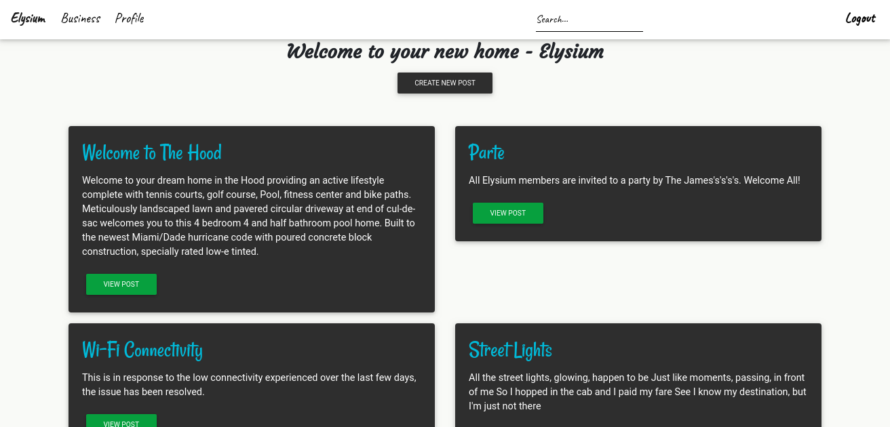
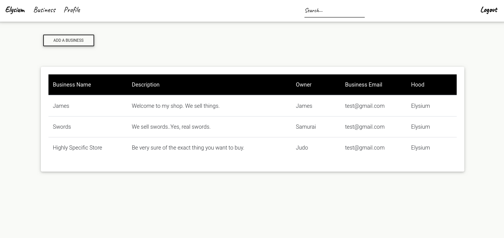

# Neighbourhood Watch
#### Author **[James N.](https://github.com/jay-68)**

## Description
A web application that allows you to be in the loop about everything happening in your neighborhood. From contact information of different handyman to meeting announcements or even alerts.






## Live link

https://hoodwatch68.herokuapp.com/

## BDD

| Behavior            | Input                         | Output                        |
| ------------------- | ----------------------------- | ----------------------------- |
|Register and select hood on log in | Click on a profile| User profile is displayed |
| Post news or alerts | Click on the post button to view more| User redirected to the posts main page |
| Search | Search users| Redirects you to user's profile page |
| Click on businesses | redirect to business page | Takes the user to the posts with people businesses|


### Prerequsites
    - Python 3.6
    - Ubuntu software
    - Django

### Clone the Repo
Run the following command on the terminal:

`git clone https://github.com/Jay-68/neighbourhood`

Install  [Postgres](https://www.postgresql.org/download/)
 
### Create a Virtual Environment
Run the following commands in the same terminal:
`pip install virtualenv`
`python3.6 -m venv virtual`
`source virtual/bin/activate`

### Install dependencies
Install dependencies that will create an environment for the app to run
`pip3 install -r requirements`

### Create a database

```
psql

CREATE DATABASE <database_name>;

```

## Run initial Migration
```
python3.6 manage.py makemigrations neighbourhood
python3.6 manage.py migrate

```


### Running the app in development
In the same terminal type:
`python3 manage.py runserver`

Open the browser on `http://localhost:8000/`

## Known bugs

Search functionality issues. Fix coming soon.


## Technologies used
    - Python 3.6
    - HTML
    - CSS
    - Material Design Bootstrap
    - Django2
    - Postgresql

## Support and contact details
Contact me on ngari.james.n@gmail.com  for any comments, reviews or collaboration.

### License
MIT - Licence